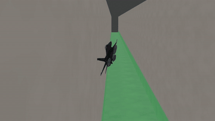
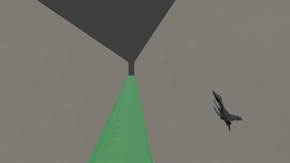
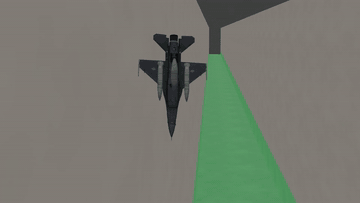
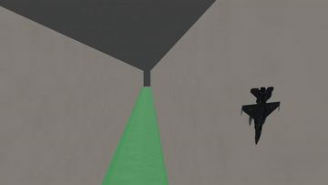
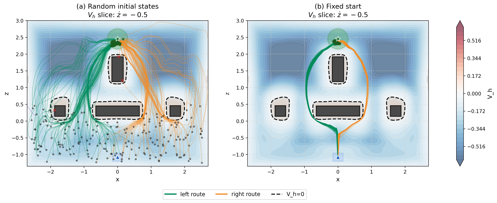

<div align="center">

# Safe Score Matching

### Diffusion Policies with Hamilton–Jacobi Reachability<br>for Online Safe Reinforcement Learning

**NeurIPS 2026**

[Method](#method) · [Training](#training) · [Evaluation](#evaluation) · [Installation](INSTALL.md)

</div>

Safe Score Matching (SSM) combines an expressive diffusion policy with a learned
Hamilton–Jacobi reachability critic: pursue reward through feasible actions,
and seek lower predicted violation when recovery is needed.

<p align="center">
  <a href="docs/assets/videos/Extreme_Recovery_front_1_1080p.mp4"></a>
  <a href="docs/assets/videos/Extreme_Recovery_Rear_1_1080p.mp4"></a>
</p>
<p align="center"><b>Recovery from a banked climb.</b><br>Initially 33° nose-up with a 62° bank.</p>

<p align="center">
  <a href="docs/assets/videos/Extreme_Recovery_front_2_1080p.mp4"></a>
  <a href="docs/assets/videos/Extreme_Recovery_Rear_2_1080p.mp4"></a>
</p>
<p align="center"><b>Recovery from a near-inverted steep dive.</b><br>Initially 74° nose-down with 176° roll and a −413°/s body-axis roll rate.</p>

Front view on the left; rear view on the right. Click a preview for the 1080p, 60 fps video.

These selected demonstrations use a Stage-B controller with 512-wide networks.
The repository provides both [Stage-A](configs/f16.yaml) and
[Stage-B](configs/f16_stage_b.yaml) F16 training recipes.

## Method

SSM trains an expressive diffusion policy with a Hamilton–Jacobi reachability
critic. In feasible states, its target favors high-reward actions that preserve
feasibility. Outside the feasible set, it favors actions with lower predicted
worst-case violation.

Using the paper's notation, the entropy-regularized target is

```math
\pi^\star(a\mid s)=
\begin{cases}
\dfrac{\exp\bigl(\alpha_r Q_r^\pi(s,a)\bigr)\,\mathbf{1}\{Q_h^\star(s,a)\leq 0\}}{Z_f(s)},
& s\in\mathcal{S}_f^\star,\\[10pt]
\dfrac{\exp\bigl(-\beta Q_h^\star(s,a)\bigr)}{Z_{\mathrm{rec}}(s)},
& s\notin\mathcal{S}_f^\star.
\end{cases}
```

Here $`Q_r^\pi`$ is the reward value, $`Q_h^\star`$ is the optimal reachability value,
and $`\mathcal{S}_f^\star`$ is the feasible state set; $`Z_f`$ and $`Z_{\mathrm{rec}}`$
normalize the two branches. This fixed-critic target motivates the actor update.
The online algorithm uses learned critics and approximate feasibility gates.

Writing $`V_h(s)=\min_a Q_h(s,a)`$ for the state gate, the paper defines the actor's guidance field

```math
\bar{\varphi}(s,a)=
\begin{cases}
\alpha_r\,\nabla_{\!a}Q_r(s,a),
& V_h(s)\leq 0,\;Q_h(s,a)\leq 0,\\[4pt]
-\beta\,\nabla_{\!a}Q_h(s,a),
& V_h(s)>0,
\end{cases}
```

with $`\bar{\varphi}(s,a)=0`$ otherwise. The denoiser regresses
$`\epsilon_{\mathrm{target}}(s,a_t)=-M_q\bar{\varphi}(s,a_t)`$ with a squared loss,
where $`M_q>0`$ controls guidance strength and the target is stop-gradient.

<details>
<summary><b>Implementation notes</b></summary>

The zero extension is a convention outside the feasible action support, where
the classical log-density score is undefined.

The control-task recipes use critic-gradient guidance, including gradient
normalization and guidance outside the feasible action set. The velocity recipes
use posterior-mean noise targets estimated by self-normalized importance sampling
(SNIS). These are distinct practical actor updates; each task YAML selects its
implementation. Learned critics and finite-sample approximations do not provide
a global safety guarantee.

</details>

## Planar stabilize-avoid

A planar quadrotor learns routes around obstacles to a goal, separate from the
Quad2D tracking benchmark below.

[](docs/assets/fig1_quad2d_stab_avoid.png)

**Planar stabilize-avoid (Figure 1 in the paper).** Green and orange indicate
left and right routes; red crosses mark collisions. The left panel uses
random initial states; the right uses perturbations near the nominal start.
The background is a learned HJ-value slice at $`\dot z=-0.5`$; dashed contours
mark $`V_h=0`$, the estimated viable-set boundary.

The [two-stage example](examples/quad2d_stabilize_avoid/README.md) provides training
curricula, evaluation, plotting, and [three-seed reproduction results](examples/quad2d_stabilize_avoid/results/RESULTS.md).

## Velocity benchmarks

The released velocity recipes were trained for 1M steps on each of five seeds.
Values below are mean ± sample SD across seeds, with 50 evaluation episodes per
seed. Cost counts velocity-limit violations over a 1000-step episode. Display
precision follows the paper; a rounded zero does not mean there were no violations.

| Task | Reward ↑ | Cost ↓ |
|---|---:|---:|
| SafetyHalfCheetahVelocity-v1 | 2754 ± 13 | 0.0 ± 0.1 |
| SafetySwimmerVelocity-v1 | 45 ± 6 | 0.5 ± 0.4 |

## Training

Use Python 3.10 and a separate environment for each backend. GPU setup and
optional tracking are covered in [INSTALL.md](INSTALL.md).

<details open>
<summary><b>Quad2D, Quad3D and F16</b></summary>

```bash
python3.10 -m venv .venv-custom
source .venv-custom/bin/activate
python -m pip install -r requirements-custom.txt
```

</details>

<details>
<summary><b>HalfCheetah and Swimmer</b></summary>

```bash
python3.10 -m venv .venv-velocity
source .venv-velocity/bin/activate
python -m pip install -r requirements-velocity.txt
python -m pip install --no-deps gymnasium-robotics==1.2.2 safety-gymnasium==1.0.0
```

See [INSTALL.md](INSTALL.md) for the environment packages' dependency constraint.

</details>

Each command below reads its task YAML directly.

| Task | Run | Parameters |
|---|---|---|
| Quad2D tracking | `bash scripts/train/quad2d.sh` | [quad2d.yaml](configs/quad2d.yaml) |
| Quad3D stabilization | `bash scripts/train/quad3d.sh` | [quad3d.yaml](configs/quad3d.yaml) |
| F16 stabilization, Stage A | `bash scripts/train/f16.sh` | [f16.yaml](configs/f16.yaml) |
| F16 stabilization, Stage B | `bash scripts/train/f16_stage_b.sh` | [f16_stage_b.yaml](configs/f16_stage_b.yaml) |
| HalfCheetah velocity | `bash scripts/train/cheetah.sh` | [cheetah.yaml](configs/cheetah.yaml) |
| Swimmer velocity | `bash scripts/train/swimmer.sh` | [swimmer.yaml](configs/swimmer.yaml) |

See [reset distributions and curricula](configs/README.md) for the three custom
tasks, including environment presets and inherited defaults.

Use the task-specific YAML settings. In the velocity recipes, `h-hardgap` is
**0.5 for HalfCheetah** and **0 for Swimmer**: a positive value replaces positive
constraint values in the safety-critic target; zero disables this replacement.

Override parameters without editing the source:

```bash
bash scripts/train/f16.sh --set seed=1 --set run_name=f16_seed1
```

Use a unique run name for each run. Add `--dry-run` to inspect the command.
Training saves logs and model files locally; external tracking is off by default.

## Evaluation

Evaluate one checkpoint with its task protocol:

```bash
python evaluate.py --config evaluation/swimmer.yaml \
  --checkpoint runs/swimmer/checkpoints/step_1000000.pkl --out swimmer_eval.json
```

Use `evaluation/<task>.yaml` for another task. See [evaluation protocols](EVALUATION.md)
for initial states, metrics, checkpoint requirements and comparison with the paper.

## Acknowledgements

Built on [Q-Score Matching](https://github.com/escontra/score_matching_rl),
[JAXRL](https://github.com/ikostrikov/jaxrl), and the reachability perspective of
[FISOR](https://github.com/ZhengYinan-AIR/FISOR).
Released under the [MIT License](LICENSE). See [third-party notices](THIRD_PARTY_NOTICES.md)
for source acknowledgements and the licenses of bundled components.
